# Wonder Cakes

[View the live project here](https://wondercakes.herokuapp.com/ "Link to deployed site - Wonder Cakes")

## Table of contents

1. [UX](#ux)

    * [Strategy](#strategy)

        * [Project overview](#project-overview)

        * [Project goals](#project-goals)

        * [User stories](#user-stories)

    * [Scope](#scope)

        * [Consistent features implemented](#consistent-features-implemented)

        * [Features left to implement](#features-left-to-implement)

    * [Structure](#structure)

        * [Database model](#database-model)
        
        * [Applications](#applications)

    * [Skeleton](#skeleton)

        * [Wireframes](#wireframes)

    * [Surface](#surface)

        * [Color scheme](#color-scheme)

        * [Typography](#typography)

        * [Imagery](#imagery)

    * [Web marketing](#web-marketing)

        * [SEO](#seo)

        * [Social media marketing](#social-media-marketing)

        * [Email marketing](#email-marketing)

        * [Privacy policy](#privacy-policy)

* [Testing](#testing)

    * [User story testing](#user-story-testing)

    * [Manual testing](#manual-testing)

    * [Bugs ans issues](#bugs-and-issues)

    * [Validator testing](#validator-testing)

* [Deployment](#deployment)

* [Credits](#credits)

    * [Technologies Used](#technologies-used)

	* [Frameworks, Libraries & Programs Used](#frameworks,-Libraries-&-Programs-Used)

	* [Content](#content)

	* [Media](#media)

* [Acknowledgments](#aknowledgements)

## UX

## 1.  Strategy

### Project overview

This is a fictitious project that is part of the Diploma in Full Stack Software Development (E-commerce Applications) 

"Wonder Cakes" is an online store aimed directly at consumers (B2C) who need personalized cakes for special occasions. The consumer has an online catalog so that he can select and customize his product, as well as a date for order’s delivery.
The consumer will have the opportunity to register and create a profile to complete the purchase or simply to save the order and be able to edit it if necessary.

### Project goals

[Here](https://github.com/iama3191/PP5-CI/issues) is a list of user stories displayed as a Kanban board.

### User Stories 

## 2. Scope 

### Consistent features implemented

Most of the features have been designed to look the same, to allow users to gain familiarity with the site layout and enable them to find information quickly.

* Card design for main layout

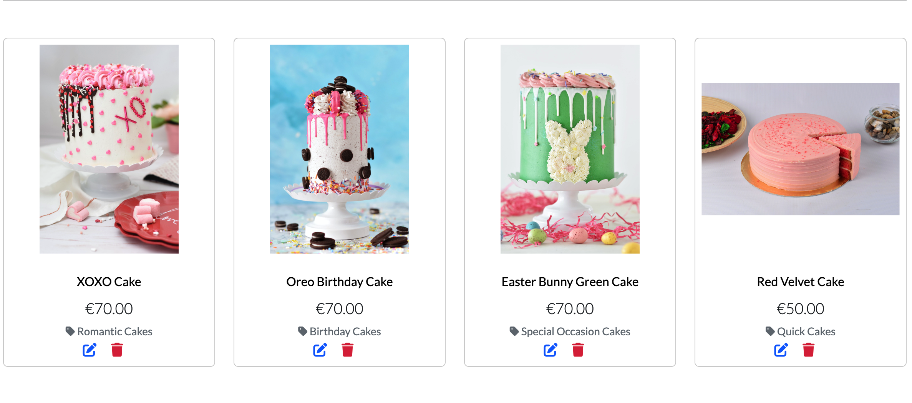

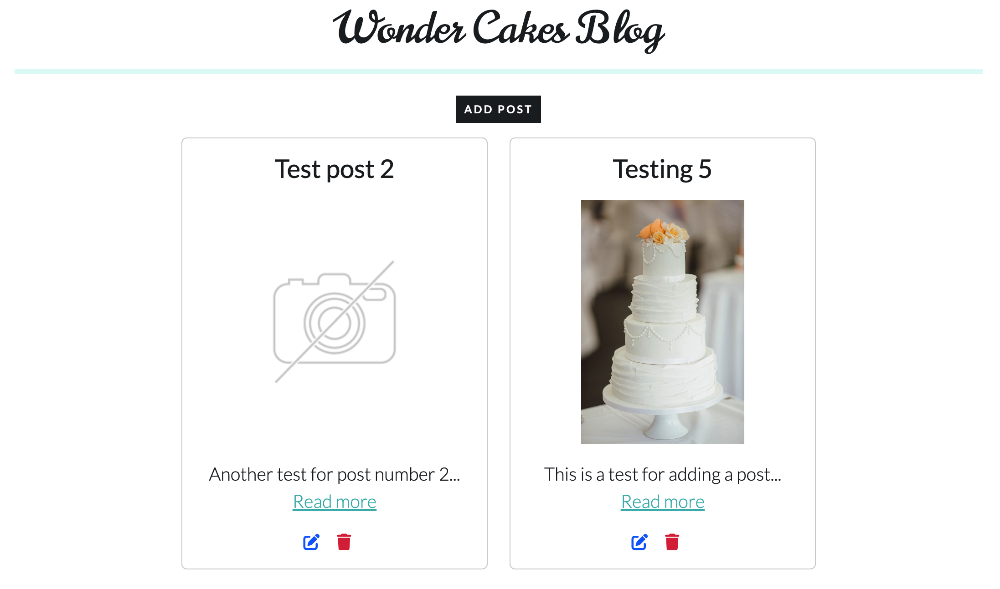

* Form submission

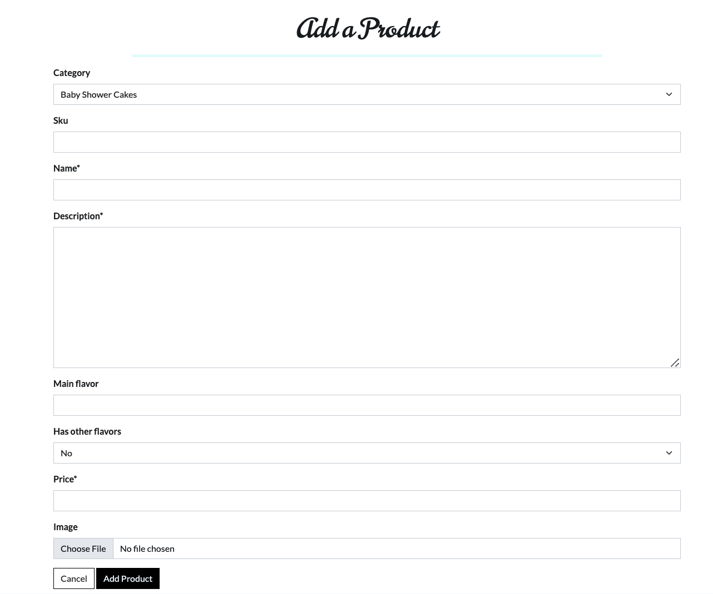

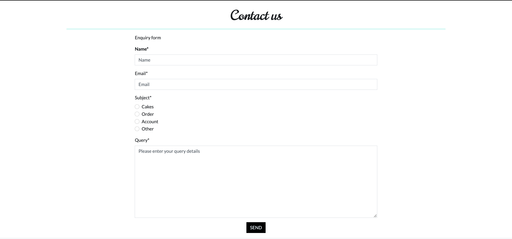

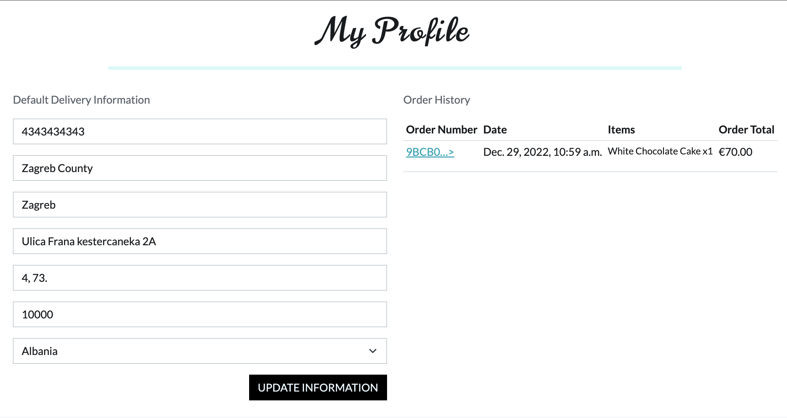

### Unique features implemented

* Footer has some colors that are combined with the hero image on the home page

### Future features

Refer to the future improvements of [user story](https://github.com/users/iama3191/projects/8).

## 3. Structure

### Database model

For this project, the database model was created from scratched, searching for different options on the web, and creating a particular data base.

### Applications

In this project, seven applications have been created:

* Home

* Wonder_cakes

* Bag

* Blog

* Checkout

* Contact

* Products

The custom models for PP5 are in:

* Products app

* Blog app

* Contact app

## 4. Skeleton

### Wireframes

 At the beginning of the project, after researching about prices and how a cake shop website looks like, I started to create a low fidelity wirefram for some of the pages I created after. At the end, the design was fixed with small changes for a better UX design.

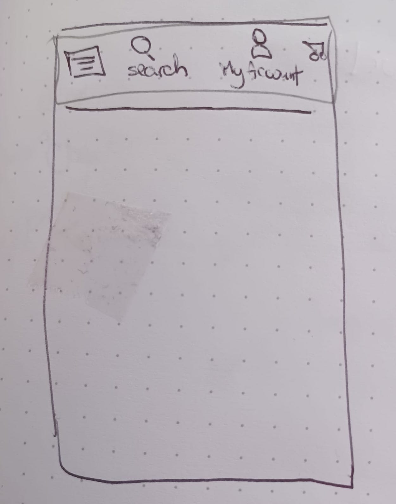

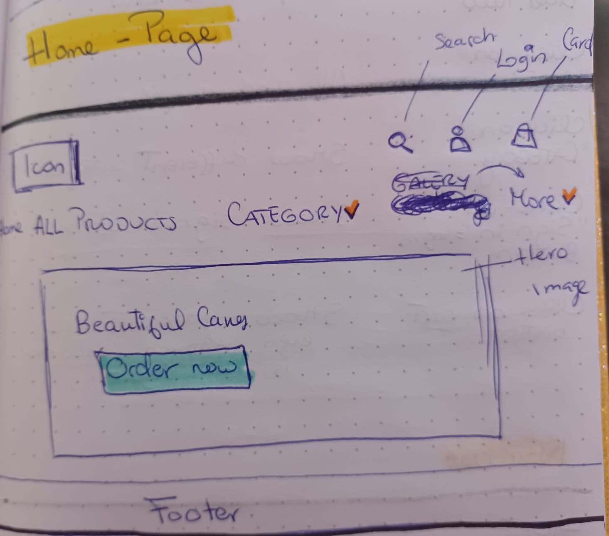

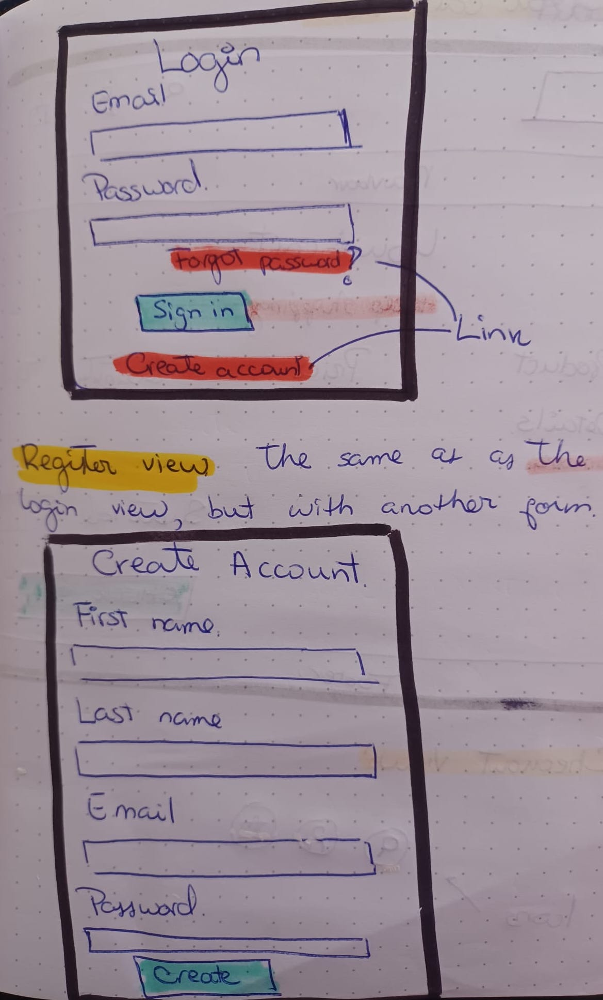

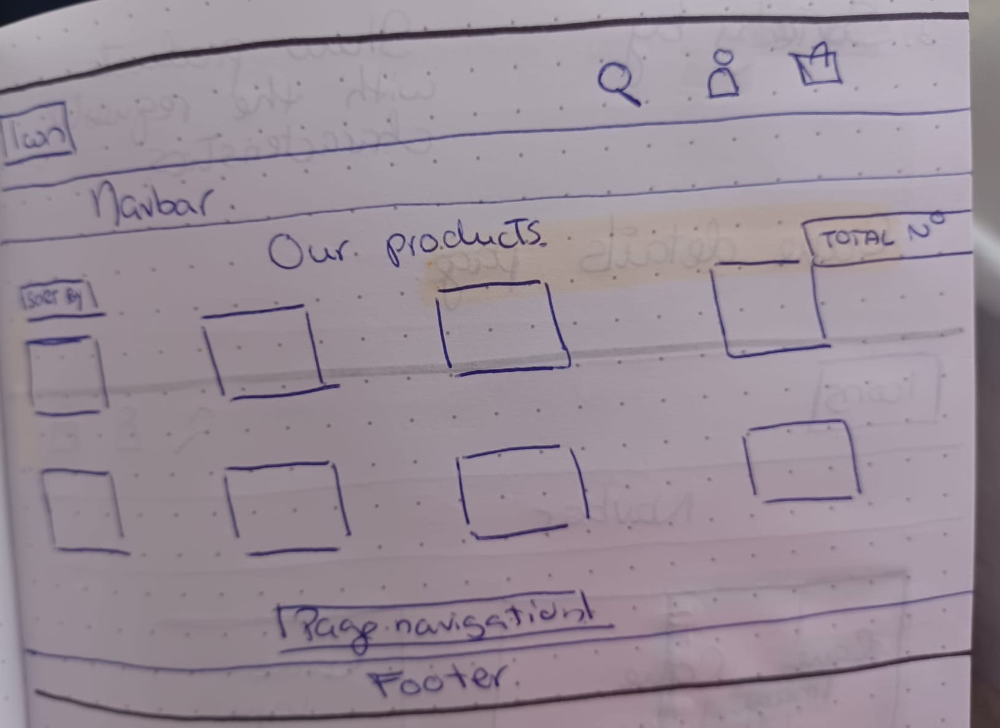

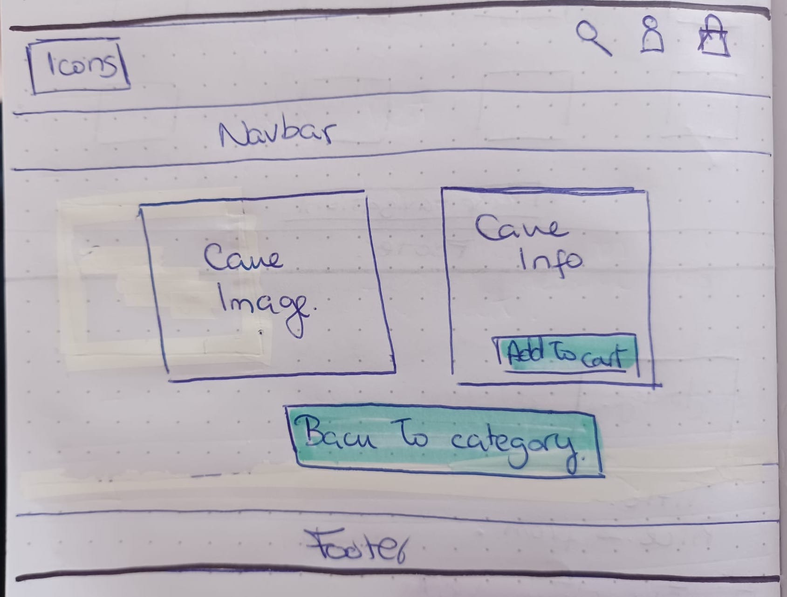

## 5. Surface

#### Color scheme

The color scheme used where colorful, fresh and minimalist colors because the main focus were on the product images.

### Typography

Two fonts were selected from Google Fonts: Lato and Norican. The first one was selected because is easily readable and the second one was selected for special headings because is very similar to the typography from the icon.

### Imagery

The images for the project were selected from many free services of photo banks. For more information about this, go to Frameworks, Libraries & Programs Used at the end of this document.

## 6. Web marketing

The web marketing techniques implemented in this project have been inspired from the Code Institute series of videos on Introduction to Search Engine Optimization and Web Marketing, for the Full Stack Development (E-commerce applications) course.

### SEO

### Social media marketing

The used tool was Facebook for the number of users, and that would be excelent in a real business if the person knows how to deal with this platform.

A [Facebook page](https://www.facebook.com/WonderCakes22) was created.

[About](README_documentation/social-media-marketing/fb-1.png)

[Post](README_documentation/social-media-marketing/fb-3.png)

[Hero image](README_documentation/social-media-marketing/fb-4.png)

[Album post](README_documentation/social-media-marketing/fb-5.png)

### Email marketing

It was implemented an email marketing feature on the footer where the user can submit his email for a newsletter.

This tool is from MailChimp, and it was personalized in order to fit the rest of the project.

[MailCchimp](README_documentation/extra-img/mailchimp.png)

## Testing

## 1. User story testing

## 2. Manual testing

All the manual testing was made on the [deployed site](https://wondercakes.herokuapp.com/):

| Page            | Section                         | Test                                                                                                                                                                                                                                                 | Result                                                                                                                                                                                                                                                                                                                                    |
|-----------------|---------------------------------|------------------------------------------------------------------------------------------------------------------------------------------------------------------------------------------------------------------------------------------------------|-------------------------------------------------------------------------------------------------------------------------------------------------------------------------------------------------------------------------------------------------------------------------------------------------------------------------------------------|
| Home            | Navigation                      | Logo link when clicked from any page needs to direct back to the home page                                                                                                                                                                           | Tested from different pages, and this works                                                                                                                                                                                                                                                                                               |
| Home            | Navigation                      | Search button shows correct results.                                                                                                                                                                                                                 | * When a search is not made but the search icon is selected, an error message appears "You didn't enter any search criteria". * Searched for flavor 'chocolate' and any product with this word in the name or in the description is showns. * Searched for any word that won't match with the project, like 'math'. Didn't show a result. |
| Home            | Navigation                      | Navigation links go to the correct pages.                                                                                                                                                                                                            | All links were tested, and they directed to the correct pages.                                                                                                                                                                                                                                                                            |
| Home            | Navigation                      | Logged in user status                                                                                                                                                                                                                                | It was used two different acccounts: One from superuser and non-superuser- The status is shown in both cases, after the user clicks on the account tab.                                                                                                                                                                                   |
| Home            | Hero container                  | Call to action button 'Shop now' leads to the 'All products' page.                                                                                                                                                                                   | It works                                                                                                                                                                                                                                                                                                                                  |
| Home            | Footer                          | Social media links need to open in a new tab.                                                                                                                                                                                                        | All links opened in a new tab, and the facebook link directs to the facebook 'Wonder Cakes' page.                                                                                                                                                                                                                                         |
| Home            | Footer                          | Mailchimp: subscribe newsletter needs to accept the user email and it requires an input.                                                                                                                                                             | If the user doesn't enter an input, a message is shown 'This field is required'. If the user enters a valid input, a message is shown 'Thank you for your subscribing!'                                                                                                                                                                   |
| About us        | Content                         | Click on the contact us here, needs to direct to the contact page.                                                                                                                                                                                   | It works                                                                                                                                                                                                                                                                                                                                  |
| About us        | Content                         | Call to action buttons 'All products' and 'blog me' need to direct to their pages.                                                                                                                                                                   | It works                                                                                                                                                                                                                                                                                                                                  |
| Contact us      | Form                            | All the inputs are required so the form is valid.                                                                                                                                                                                                    | If the user doesn't enter all the fields, it will be required and the form won't pass. If the user enters all the fields, a message is shown 'thank you for your enquiry...'                                                                                                                                                              |
| FAQ             | links                           | Click on the links for sending email or accesing to the website.                                                                                                                                                                                     | It works.                                                                                                                                                                                                                                                                                                                                 |
| FAQ             | links                           | Call to action button 'All products' leads to the 'All products' page.                                                                                                                                                                               | It works                                                                                                                                                                                                                                                                                                                                  |
| All products    | Sorting field                   | Selecting any option, needs to arrange the display of the products                                                                                                                                                                                   | It works.                                                                                                                                                                                                                                                                                                                                 |
| All products    | Back to the top link            | Clicking on the arrow icon, needs to take the user back to the top.                                                                                                                                                                                  | It works, but it will be nice that the icon only appears after the user scrolls down.                                                                                                                                                                                                                                                     |
| All products    | icon links                      | Clicking on the pencil (for editing) and on the trash can (for deleting), the admin can either edit or delete the product.                                                                                                                           | It works, by clicking on the pencil, the admin is redirected to the edit page. If the admin clicks on the trash can, it will delete the item (it sould be nicer to have more security for that action) NOTE: these links aren't shown for a non-superuser                                                                                 |
| Product_details | icon links                      | Clicking on the pencil (for editing) and on the trash can (for deleting), the admin can either edit or delete the product.                                                                                                                           | It works, by clicking on the pencil, the admin is redirected to the edit page. If the admin clicks on the trash can, it will delete the item (it sould be nicer to have more security for that action) NOTE: these links aren't shown for a non-superuser                                                                                 |
| Product_details | increment or decrement quantity | Clicking on the minus icon, decrement the quantity  of items for adding to the bag, the min value is 1. The increment icon, add items to the bag.                                                                                                    | It works                                                                                                                                                                                                                                                                                                                                  |
| Product_details | Call to action button           | Clicking on the 'Keep shopping' button, needs to direct to the 'All products' page, and by clicking on the 'Add to bag' button, adds the item to the bag, if the user doesn't change the quantity or the flavor, it will add the default input       | It works                                                                                                                                                                                                                                                                                                                                  |
| Bag             | Call to action button           | Clicking on the 'Keep shopping' button, needs to direct to the 'All products' page, and by clicking on the 'Secure checkout' button, directs the user to the checkout page.                                                                          | It works                                                                                                                                                                                                                                                                                                                                  |
| Bag             | increment or decrement quantity | Clicking on the minus icon, decrement the quantity  of items for adding to the bag, the min value is 1. The increment icon, add items to the bag.  After modifying the quantities, the user needs to click on the 'update' link, so it is effective. | It works                                                                                                                                                                                                                                                                                                                                  |
| Checkout        | Form                            | The user will have a checkout form for delivering and paying, all the required fields need to be entered in order to complete the order                                                                                                              | It works                                                                                                                                                                                                                                                                                                                                  |
| Checkout        | Call to action button           | Clicking on the 'Adjust Bag' button, needs to direct back to the 'Bag' page, and the 'Complete order' button needs to direct to the payment procedure, and if it is valid, it will direct to the 'Checkout success' page.                            | It works                                                                                                                                                                                                                                                                                                                                  |
| Profile         | Form                            | The user will have a form where he can update his personal info, and after clicking on the 'update information', a success message will be shown: 'Profile was updated successfully'                                                                 | It works                                                                                                                                                                                                                                                                                                                                  |
| Profile         | Order number links              | After the user make an order, he will have a history order where he can access to each order, the link needs to direct to the checkout success page of the product.                                                                                  | It works                                                                                                                                                                                                                                                                                                                                  |
NOTE: The post app was also tested manually, and it has the same logic as the product app where only a superuser has CRUD functionality, because of this, the results are exactly the same.

### * Browser Testing

I have tested that this application works using Mackboor Air(Retina, 13-inch, 2020), with macOS Monterey 12.6 installed, using the following browsers.

* Google Version 105.0.5195.125 (Official Build) (arm64)

## 3. Bugs and issues

| Problem                                                                                                                                                                                                                                                           | Solution                                                                                                                            |
|-------------------------------------------------------------------------------------------------------------------------------------------------------------------------------------------------------------------------------------------------------------------|-------------------------------------------------------------------------------------------------------------------------------------|
| Create product.json and categories.json from scratch, I used a json formatter and when I tried to load the data, it couldn't because the syntax wasn't correct                                                                                                    | I submitted all my data into django admin, and then I dumped the data into my project and it was solved.                            |
| Create post app where the superuser has CRUD functionalities, after creating all my templates, when I wanted to create a post as an admin, it presented the error: 'template does not exist'                                                                      | I checked urls.py and views.py, then I change the order of the urls' path and placed it on top. It was solved.                      |
| Add a new field to my model.py for the products app ('main flavor'). While displaying the flavors on the product_detail.html using an if statement with a , exactly like on the Boutiqe-Ado project. In some products it appeared two times this field. | I changed the if statement with a more simple one, and it shows the right flavor for every product. It was solved.                  |
| After adding the footer, on my home page it seems to stick to the bottom, but on the other pages with less content, it wasn't at the same place.                                                                                                                  | I added to the body (min-height:100vh; display:flex; flex_direction:column) , and added to the footer (margin-top:auto). It solved. |

## 4. Validator testing

### [W3 HTML Validator](https://validator.w3.org/#validate_by_input)

This tool was used for checking all the pages of the project, on the following table is presented the warnings for each page and their resolution.

| Page                                                                                                                           | Error                                                                              | Resolution                                                                                                                                           |
|--------------------------------------------------------------------------------------------------------------------------------|------------------------------------------------------------------------------------|------------------------------------------------------------------------------------------------------------------------------------------------------|
| Home, About, Contact, All Products, Product Detail, Add Product, Bag, Checkout success, Blog, Add post, Edit post, Delete post |                | The code was copy directly from Mailchimp. It did not affect the functionality. In fact all the pages has  this same error because is on the footer. |
| FAQ                                                                                                                            |                  | The <a> tag has an space after 'mailto:',  I removed it and change the subject for one word. The problem was solved.                                 |
| Profile                                                                                                                        |          | It presented to closing <tr> tags, I deleted one. The problem was solved.                                                                            |
| Edit Product                                                                                                                   |        | It presented a typo in the <scrip> tag, added 't'. The problem was solved.                                                                           |
| Checkout                                                                                                                       |        | 1. Changed the <label> tag for a div, and remove the  for attribute. 2. Changed the <h1> tag for a 
 for the spinner.  The problem was solved.   |
| Post Detail                                                                                                                    |  | The 
 tag had an unclosed <small> tag, after adding '/' the problem was solved                                                                   |

### [CC3 W3 Validator](https://jigsaw.w3.org/css-validator)

This tool was used on the next files:

* base.css
* profiles.css
* checkout.css

This files didn't present errors or warnings.

 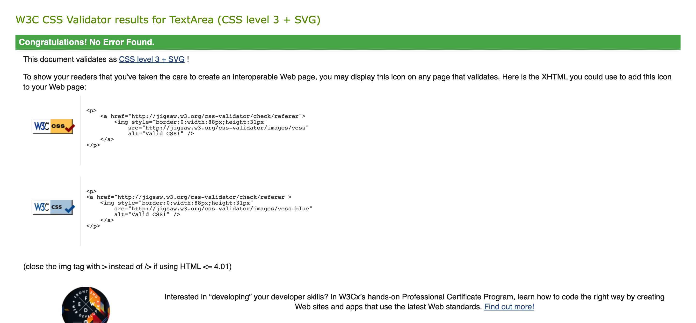

### [JShint Validator](https://jshint.com/)

This tool was used for the stripe_element.js file and got three warnings, a semicolon was added on line 117

 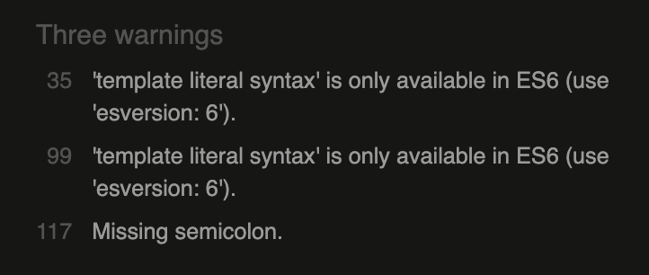

## Deployment

- This project was developed using a [GitPod](https://gitpod.io/ "Link ot GitPod") workspace. 
- The code was commited to [Git](https://git-scm.com/ "Link to Git").
- The code was pushed to [GitHub](https://github.com/ "Link to GitHub") using the terminal.

The regular process for deployment can be found on the CI Cheat Sheet from the Full Stack Framework.

### Prerequesites

1. Create a repository and workspace

* Create a repository in Github - using the Code Institute [Gitpod Full Template](https://github.com/Code-Institute-Org/gitpod-full-template "Link to gitpod template")

* Click on the green Gitpod button to load the repository workspace in Gitpod.

2. Install Django

* Install Django and Gunicorn ( it will be used to run Django on Heroku) and type the following command in the terminal:

        pip3 install Django=3.2 gunicorn

3. Add python code to .gitgnore file, that are not required in version control

        *.sqlite3
        *.pyc
        __pycache

4. Check that the project's installation is ok by running it on the server, type in the terminal:

        python3 manage.py runserver

    Then open un Port 8000 and the server should say that "The install worked successfully"

5. Run initial migrations with the following code:

        python3 manage.py migrate

6. Create a superuser, type into the terminal:

        python3 managepy createsuperuser

    and add username, email and password

7. Make initial commit to Github by typing the following code:

        git add .
        git commit -m "Initial commit"
        git push

### Deployment

1. Create an external database, using ElephantSQL.

    * Log in to [ElephantSQL.com](!https://www.elephantsql.com/) to access your dashboard.

    * Click the green button 'Create a New Instance'.

    * Set up your plan

        * Give your plan a Name (this is commonly the name of the project)
        * Select the Tiny Turtle (Free) plan
        * You can leave the Tags field blank

    * Select a data center near you.

    * Then click the 'Review' button.

    * Check your details are correct and then click “Create instance” button.

    * Return to the ElephantSQL dashboard and click on the database instance name for this project.

    * In the URL section, clicking the copy icon will copy the database URL to your clipboard.

2. Create a new Heroku app

    * Go to [Heroku Dashbord](https://dashboard.heroku.com/) and click 'New' to create a new app.

    * Give your app a name and select the region closest to you. When you’re done, click Create app to confirm.

    * Open the Settings tab.

    * Add the config var DATABASE_URL, and for the value, copy in your database url from ElephantSQL.

3. In the terminal in Gitpod:
 
    * Install dj_database_url and psycopg2, both of these are needed to connect to your external database.

        pip3 install dj_database_url==0.5.0 psycopg2

    * Update your requirements.txt file with the newly installed packages

        pip freeze > requirements.txt

    * In your settings.py file, import dj_database_url underneath the import for os

        import os
        import dj_database_url

    * Scroll to the DATABASES section and update it to the following code, so that the original connection to sqlite3 is commented out and we connect to the new ElephantSQL database instead. Paste in your ElephantSQL database URL in the position indicated.

    * In the terminal, run the showmigrations command to confirm you are connected to the external database

        python3 manage.py showmigrations

    *  If you are, you should see a list of all migrations, but none of them are checked off

    * Migrate your database models to your new database

        python3 manage.py migrate

    * Load in the fixtures. Please note the order is very important here. We need to load categories first

        python3 manage.py loaddata categories

    * Then products, as the products require a category to be set

        python3 manage.py loaddata products

    * Create a superuser for your new database

        python3 manage.py createsuperuser

4. Confirming your database

    * On the ElephantSQL page for your database, in the left side navigation, select “BROWSER”

    * Click the Table queries button, select auth_user

    * When you click “Execute”, you should see your newly created superuser details displayed. This confirms your tables have been created and you can add data to your database.

5. Set up hosting for the static and media files with AWS (Amazon Web Services).

    * Create user to acces S3 bucket:

        * In AWS account, open IAM service
        * Create a grouo for the user, ideally use a name related with the project
        * Create a policy used to give fulla access to the S3 bucket and attach it to the group
        * Create a user and add them to the group
        * Download the csv file which contains the user access key and the secret key which will be used to authenticate them from Django app.

    * Connect Django to S3 bucket and static files to S3 bucket:

        * In the Gitpod termina, install boto 3 and django-storages
        * Freeze them into requirements.txt file so they get installed on Heroku upon deployment.
        * Add 'storages' to 'installed apps' in settings.py
        * To connect Django to S3: add the below code in settings.py 

        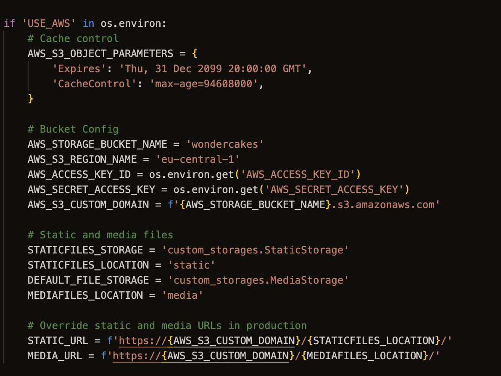

    * In Heroku app config vars- add the following keys: USE_AWS(value=True), AWS_ACCESS_KEY_ID and AWS_SECRET_ACCESS_KEY (values from the csv file).

    * Remove 'disable collectstatic' variable: Django will collectstatic files automatically and upload them to S3.

    * In the main project directory in Gitpod, create a file calles 'custom_storages.py' and add the following code to tell Django to use S3 to store static and media files:

        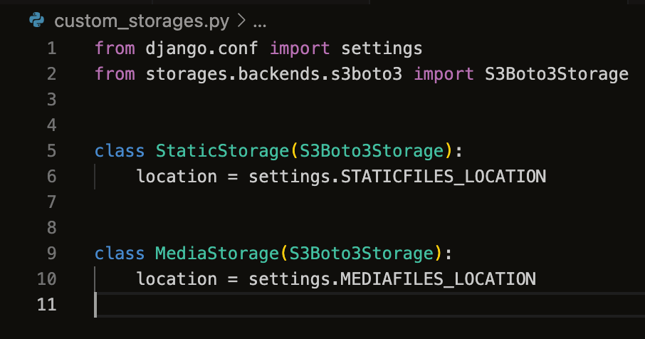

    * Commit changes to Github.

    * Heroku build log should show all static files were collected successfully.

    * AWS S3 bucket will have a static folder which will contain all the project static files.

6. Add media files to S3 bucket:

    * Open up AWS project bucket.

    * Create a new folder called 'media'.

    * Upload all images used on site and grant public read access.

7. Final steps:

    * Add Stripe keys ( obtained from stripe account > developers > API keys) to Heroku app config vars

    * Create a new webhook endpoint that sends webhooks to the Heroku app rather than to the Gitpod workspace.

    * Add webhook signing secret to Heroku app config vars.

## Credits

* Code Institute Tutor Support: for helping me when I couldn't do it by myself.

* Code Institute: Walkthrough modules in Full Stack Frameworks.

* Code Institute Slack Community: For troubleshooting and FAQ.

* Django documentation: For clarifying all the doubts.

* Stack Overflow: For troubleshooting and FAQ.

* [!Dumpdata command from Django](https://coderwall.com/p/mvsoyg/django-dumpdata-and-loaddata)

* [!How to fix the navbar](https://stackoverflow.com/questions/68381021/how-to-separate-nav-bar-from-the-rest-of-the-page)

* [!How to make footer to stick to the bottom of page](https://dev.to/nehalahmadkhan/how-to-make-footer-stick-to-bottom-of-web-page-3i14#:~:text=To%20do%20this%20just%20remove,make%20content%20align%20to%20center.)

### 1. Technologies Used

- [HTML5](https://en.wikipedia.org/wiki/HTML5 "Link to HTML Wiki")

- [CSS3](https://en.wikipedia.org/wiki/Cascading_Style_Sheets "Link to CSS Wiki")

- [JavaScript](https://en.wikipedia.org/wiki/JavaScript "Link to JavaScript Wiki")

- [Python](https://en.wikipedia.org/wiki/Python_(programming_language) "Link to Python Wiki")

### 2. Frameworks, Libraries & Programs Used

- [Django](https://www.djangoproject.com/ "Link to Django Project website"): Python Framework used in the development of the project.

- [Django Allauth](https://django-allauth.readthedocs.io/en/latest/index.html "Link to django-allauth documentation"): Used for authentication and account registration.

- [Django Crispy Forms](https://django-crispy-forms.readthedocs.io/en/latest/ "Link to django crispy documentation"): Used to simplify the rendering of Django forms.

- [Bootstrap](https://getbootstrap.com/docs/5.0/getting-started/introduction/ "Link to Bootstrap page"): Bootstrap CSS Framework used for styling and to build responsive web pages.

- [Heroku](https://dashboard.heroku.com/ "Link to the Heroku Home Page"): For deployment and hosting of the application.

- [Google Fonts](https://fonts.google.com/ "Link to Google Fonts"): To import the needed fonts for the project: 'Architects Daughter' and 'Open Sans'.

- [Font Awesome](https://fontawesome.com/ "Link to FontAwesome"): Used to add icons and make the blog more interactive.

- [Git](https://git-scm.com/ "Link to Git homepage"): Used for version control by utilizing the Gitpod terminal to commit to Git and Push to GitHub.

- [GitHub](https://github.com/ "Link to GitHub"): Used to store the projects code after being pushed from Git and to create the Kanban board used for this project.

- [Am I Responsive?](http://ami.responsivedesign.is/# "Link to Am I Responsive Homepage"): Checking the responsive.

- [Google Translate](https://translate.google.com/ "Link to Google Translate"): Checking the grammar when needed after translating from Spanish to English.

- [Coolors](https://coolors.co/ "Link to Coolors"): Program used to check compability of color of the blog.

- [Chrome DevTools](https://developer.chrome.com/docs/devtools/ "Link to developer tools page"): Used to test the response on different screen sizes, debugging and to generate a Lighthouse report to analyze page load.

- [HTML Validator](https://validator.w3.org/): Used to check the code for HTML validation.

- [W3 CSS Validator](https://jigsaw.w3.org/css-validator/): Used to check the code for CSS validation.

- [Unsplah](www.unsplash.com "Link to the home page"): Used for imagery.

- [Pexels](www.pexels.com "Link to the home page"): Used for imagery.

- [Pixabay](!https://pixabay.com/): Used for imagery.

- [freepik](!https://www.freepik.com/): Used for imagery.

- [Grammarly](!https://www.grammarly.com/ "Link to the home page"): Checked the grammar.

- [Canva](!https://www.canva.com/) : Helped on the making of the logo and the image for the icon.

- [JSON formatter](!https://jsonformatter.org/): Checked and validated the .json files (categories.json and products.json)

- [CSS Formatter](!https://www.cleancss.com/css-beautify/): Beautify the CSS files

- [jQuery CDN](!https://releases.jquery.com/): Used jQuery CDN for the project.

- [Sitemaps](!https://www.xml-sitemaps.com/): Generated the sitemap for my project.

- [MailChimp](!https://www.mailchimp.com/): Used for email-marketing service

### 3. Content

- [The cake shop](!https://the-cakeshop.co.uk/): Inspired and helped to understand how this type of business works.

- [Magnolia baker](!https://www.magnoliabakery.com/): Inspired and helped to understand how this type of business works.

### 4. Media

## Acknowledgments

* My mentor at Code Institute, Brian Macharia, for code review, help and feedback.

To create an appeling website with a great UX and UI, the developer make a research throughout the best cooking blogs, with the best and worst features.

#### Strategy
- **Roles**
    - User
    - Admin

The website needs to enable the *user* to:
- search for recipes.
- make comments to a recipe.
- like and unlike recipes.
- upload images from their experiences when adding a recipe.
- register and log in to participate in the blog.
- save recipes to a favorite page.

The website needs to enable the *admin* to:
- Create drafts for finishing later.

